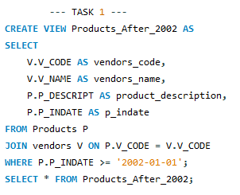
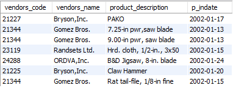
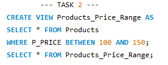
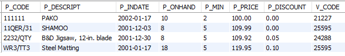
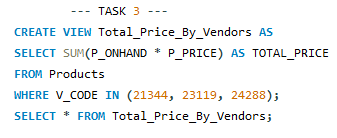
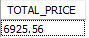
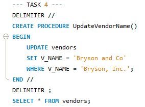
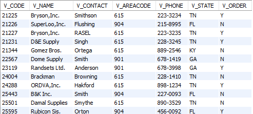
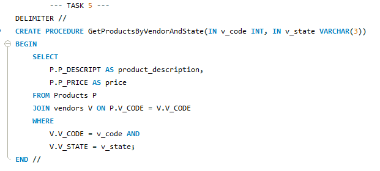
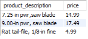

# Final Lab Task 5:  Using SQL Views, Stored Procedures and Functions
## Task 1:
- CREATE A VIEW that will display the vendors_code, vendors name, product description p_indate, of all products with p_indate from 2002 onwards
## Task 2:
- CREATE a VIEW that will display all products whose price range is between 100-150
## Task 3:
- Create a VIEW that will COMPUTE for the (TOTAL_PRICE) of ALL PRODUCTS by getting the (P_ONHAND x P_PRICE) Sold by vendors with the following v_code (21344, 23119 and 24288)
## Task 4:
- CREATE a STORED PROCEDURE that WILL take a SINGLE PARAMETER and UPDATED the Name of Vendor ‘Bryson,Inc.’ to ‘Bryson and Co’.
## Task 5:
- CREATE A Function that will take 2 parameters(v_code and v_state) and display All the product description and price based on the parameters passed to the function

### Query Statements & Table Structure:
### Task 1:
#### Query:

#### Table:

### Task 2:
#### Query:

#### Table:

### Task 3:
#### Query:

#### Table:

## Task 4:
#### Query:

#### Table

## Task 5:
#### Query:

#### Table

