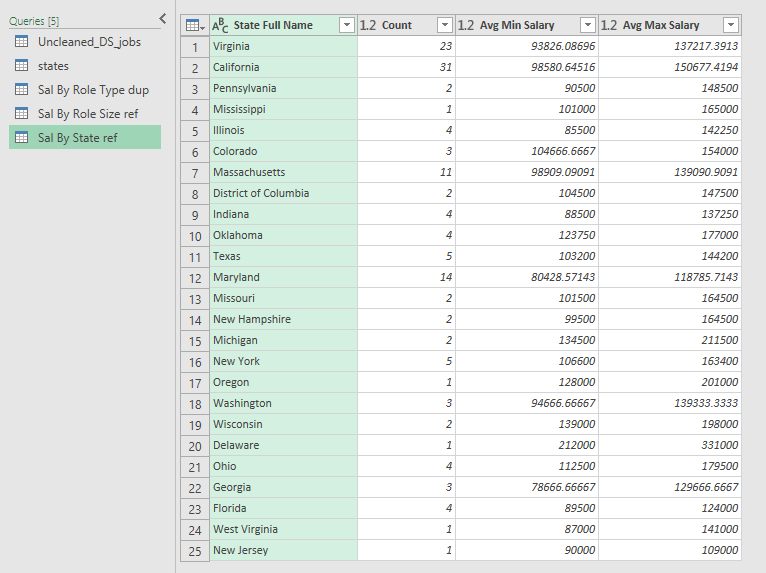
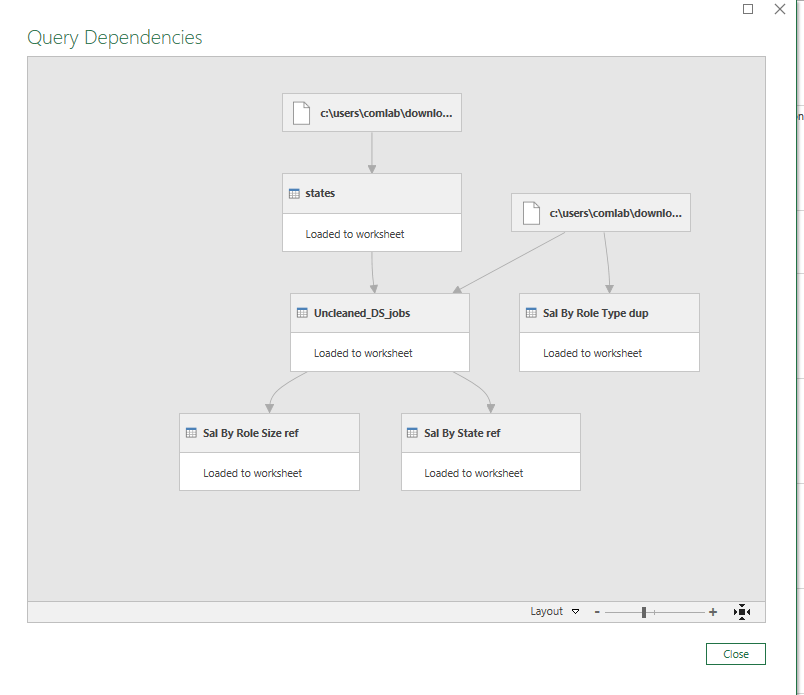

# Midterm Lab Task 2 - Data Cleaning and Preparation using Excel
For this task, we are provided with an Uncleaned_DS_jobs.csv dataset and tasked with performing data cleaning and transformation using Power Query Editor in Excel to generate meaningful insights 
## STEP 1: Download and Load Data  
- Download the dataset (Uncleaned_DS_jobs.csv)  
- Open Excel  
- Go to Data > New Query > Open File > Text/CSV  
- Click Load and then Edit using Power Query Editor  
## STEP 2: Cleaning the Data and Normalization 
### Salary Estimate Column:
- In Power Query, select the Salary Estimate column.
- Use Transform > Extract > Text Before Delimiter to remove any characters after the open parenthesis.
### Create Min and Max Salary Columns:
- Use Add Column > Column from Examples to generate the Min Sal and Max Sal columns from the Salary Estimate column.
### Add Role Type Column:
- Go to Add Column > Custom Column and use the formula to categorize job titles into roles
### Split Location Column:
- Select the Location column and use Transform > Split Column by Delimiter (Comma) to split location into separate columns.
### Location Correction:
- Create a custom column to correct location values, replacing certain locations (e.g., "New Jersey" to ", NJ", "California" to ", CA").
### Handle Negative Values:
- Filter out negative values in Competitors, Revenue and Industry columns.
### Clean Company Name:
- Remove any unwanted text from the Company Name column using Transform > Replace Values or Remove Text.
### Copy of the Data Cleaning Steps as Proof:
- Go to Home Menu > Click Advanced Editor
### Here are the screenshot of my Advance Editor

## Step 3: Reshape and Group Data
### Group by Role Type  
- Duplicate the raw data > Rename it as "Sal By Role Type dup"  
- Select only Role Type, Min Salary, and Max Salary columns  
- Change Min and Max Salary type to currency  
- Multiply values by 1000 (Numbers Column > Standard > Multiply > Type 1000)  
- Group rows by Role Type and get the average for Min and Max Salary  
### Group by Company Size  
- Create a reference of raw data > Rename it as "Sal By Role Size ref"  
- Select only Size, Min Salary, and Max Salary columns  
- Change Min and Max Salary type to currency  
- Multiply values by 1000 (Numbers Column > Standard > Multiply > Type 1000)
- Group rows by Size and get the average for Min and Max Salary
## Step 4: Merge State Mapping
- Right-click in the Queries pane > New Query > Open Workbook "State Mapping"  
- Select the columns and click OK  
- Select Uncleaned DS Jobs query  
- Choose the State Abbreviation column in both queries  
- Click Merge > Click OK  
- Rename the merged column as "State Full Name"  
- Remove nulls and blanks
### Group by State  
- Create a reference of raw data > Rename it as "Sal By State ref"  
- Select only State Full Name, Min Salary, and Max Salary columns  
- Change Min and Max Salary type to currency  
- Multiply values by 1000 (Numbers Column > Standard > Multiply > Type 1000)
- Group rows by State Full Name and get the average for Min and Max Salary
## Here are the screenshots showcasing the table transformation process:
## Here's the screenshot of my output before and after I started data cleaning
### Before:

### After:

### Here's the screenshot of Sal By Role type:

### Here's the screenshot of Sal By Role Size:

### Here's the screenshot of Sal By State:

## Step 5: View Depencies and References of the Data:
- Go to view > Click Dependies
### Here the screenshot of Query Dependies of Data:

## Here's the File of My output:
[Uncleaned_Data.xlsx](https://github.com/user-attachments/files/19233693/Uncleaned_Data.xlsx)
