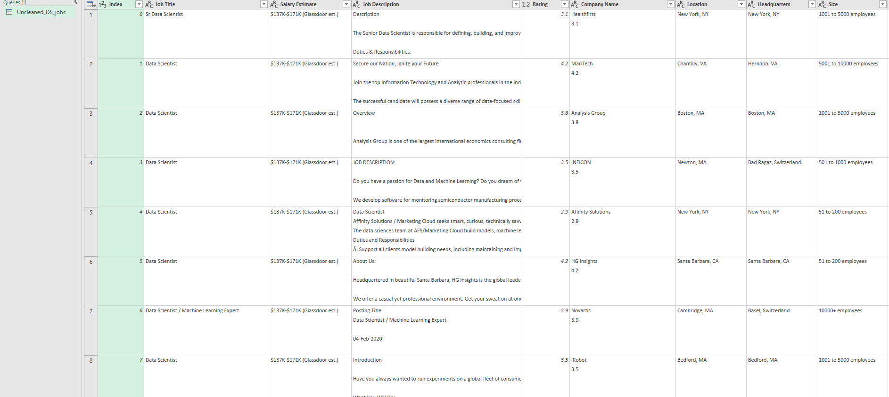

# Midterm Lab Task 1 - Data Cleaning and Preparation using Excel
For this task, we are provided with an Uncleaned_DS_jobs.csv dataset (from Kaggle) and tasked with performing data cleaning and transformation using Power Query Editor in Excel to generate meaningful insights 
## STEP 1 Download and Load Data  
- Download the dataset (Uncleaned_DS_jobs.csv)  
- Open Excel  
- Go to Data → New Query → Open File → Text/CSV  
- Click Load and then Edit using Power Query Editor  
## STEP 2 Normalization 
- Salary Estimate Column:
- In Power Query, select the Salary Estimate column.
- Use Transform > Extract > Text Before Delimiter to remove any characters after the open parenthesis.
- Create Min and Max Salary Columns:
- Use Add Column > Column from Examples to generate the Min Sal and Max Sal columns from the Salary Estimate column.
- Add Role Type Column:
- Go to Add Column > Custom Column and use the formula to categorize job titles into roles
- Split Location Column:
- Select the Location column and use Transform > Split Column by Delimiter (Comma) to split location into separate columns.
- Location Correction:
- Create a custom column to correct location values, replacing certain locations (e.g., "New Jersey" to ", NJ", "California" to ", CA").
- Handle Negative Values:
- Filter out negative values in Competitors and Industry columns.
- Clean Company Name:
- Remove any unwanted text from the Company Name column using Transform > Replace Values or Remove Text.
## STEP 3 Here's the screenshot of my output before and after I started data cleaning:
### Before:

### After:

## Step 5 Final Output Queries:

## Here's the File of My output:
